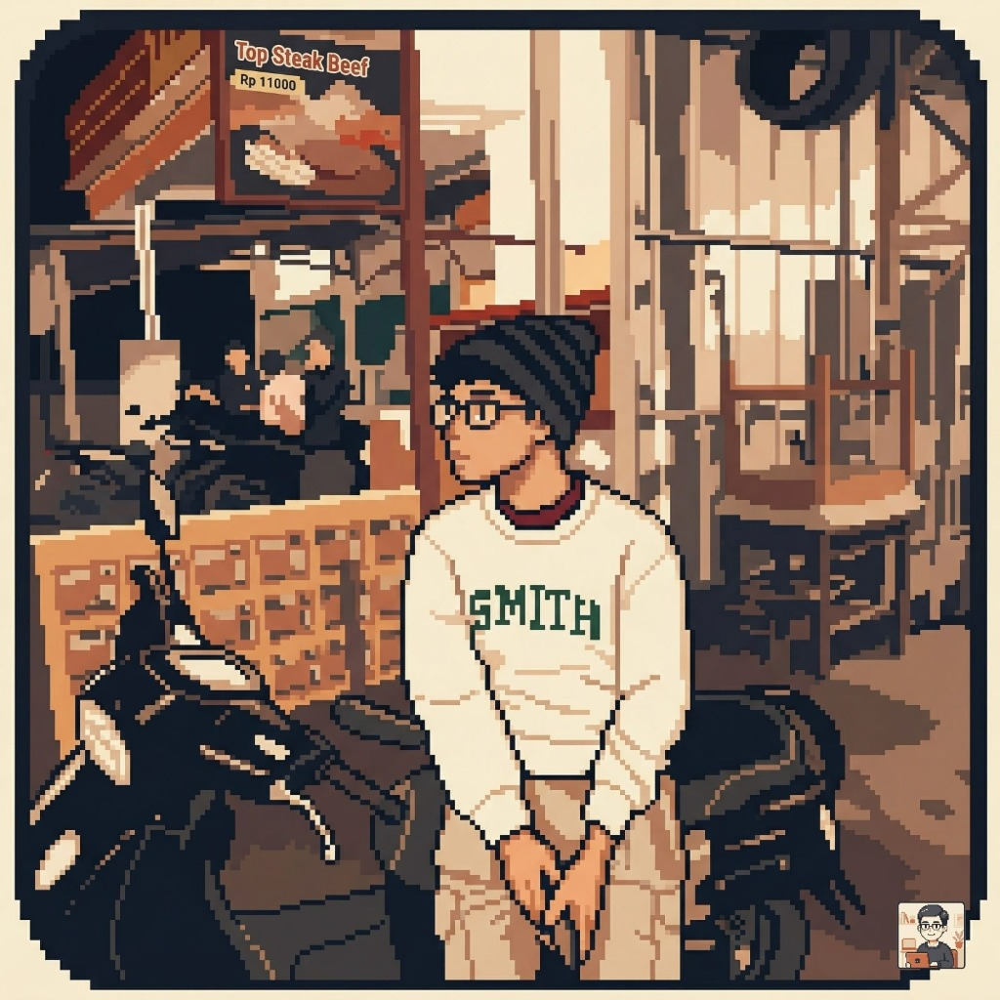

# 🥚 TwentyEgg | Personal Portfolio

<div align="center">
  
  <h3>Damar Rifaldi Mutakin</h3>
  <p><em>Informatics Student @ ITERA | Web Developer | Game Enthusiast</em></p>
  
  <p>
    <a href="https://github.com/SKYLINE28"></a>
    <a href="https://www.itera.ac.id/"></a>
    
  </p>
</div>

---

## 🎯 Tujuan Proyek (Project Purpose)

Website ini adalah **portofolio pribadi** yang dirancang dengan estetika *Retro Pixel / Brutalist* untuk merepresentasikan identitas digital saya sebagai **TwentyEgg**. Tujuan utamanya adalah:

1.  **Showcase Portofolio**: Menampilkan proyek-proyek yang telah saya kerjakan, baik di bidang pengembangan web maupun game.
2.  **Personal Branding**: Memperkenalkan diri saya sebagai mahasiswa Teknik Informatika yang aktif belajar dan berkarya.
3.  **Hub Koneksi**: Menyediakan satu tempat terpusat bagi siapa saja yang ingin terhubung dengan saya melalui berbagai platform sosial.
4.  **Eksperimen Desain**: Menjadi wadah eksplorasi desain UI/UX bertema retro menggunakan teknologi web modern (Vanilla HTML/CSS/JS).

---

## 🚀 Fitur Utama (Key Features)

-   **Retro Pixel UI**: Desain unik yang terinspirasi dari estetika game klasik dan terminal.
-   **Dark/Light Mode**: Dukungan tema yang dapat disesuaikan dengan kenyamanan mata pengguna.
-   **Responsive Design**: Tampilan yang optimal baik di perangkat mobile maupun desktop.
-   **Interactive Elements**: Efek typewriter, scroll progress bar, dan animasi reveal yang halus.
-   **Course & Support Pages**: Halaman tambahan untuk berbagi materi pembelajaran dan dukungan.

---

## 🛠️ Tech Stack

| Kategori | Teknologi |
| :--- | :--- |
| **Frontend** | HTML5, CSS3 (Custom Properties), JavaScript (Vanilla) |
| **Fonts** | [VT323](https://fonts.google.com/specimen/VT323) (Google Fonts) |
| **Icons** | Font Awesome 6.4.0 |
| **Tools** | VS Code, Git, Figma |

---

## 📂 Struktur Folder

```text
.
├── assets/
│   ├── docs/          # Dokumen seperti CV
│   └── images/        # Aset gambar dan avatar
├── css/
│   └── style.css      # Logika styling utama (Retro Theme)
├── js/
│   ├── progress.js    # Scroll progress logic
│   └── script.js      # Interaktivitas utama & Theme toggle
├── pages/
│   ├── courses.html   # Halaman kursus/materi
│   ├── support.html   # Halaman dukungan
│   └── system_menu.html
└── index.html         # Halaman utama (Landing Page)
```

---

## 🤝 Mari Berkolaborasi!

Saya selalu terbuka untuk diskusi mengenai teknologi, pengembangan game, atau peluang kolaborasi proyek.

-   **Instagram**: [@darimu.mar](https://www.instagram.com/darimu.mar)
-   **YouTube**: [@GFLINE28](https://youtube.com/@GFLINE28)
-   **Discord**: [Join My Server](https://discord.gg/UQZR852tHw)
-   **GitHub**: [SKYLINE28](https://github.com/SKYLINE28)

---

<div align="center">
  <p>Crafted with 🧡 by <strong>TwentyEgg</strong>. © 2026</p>
</div>
